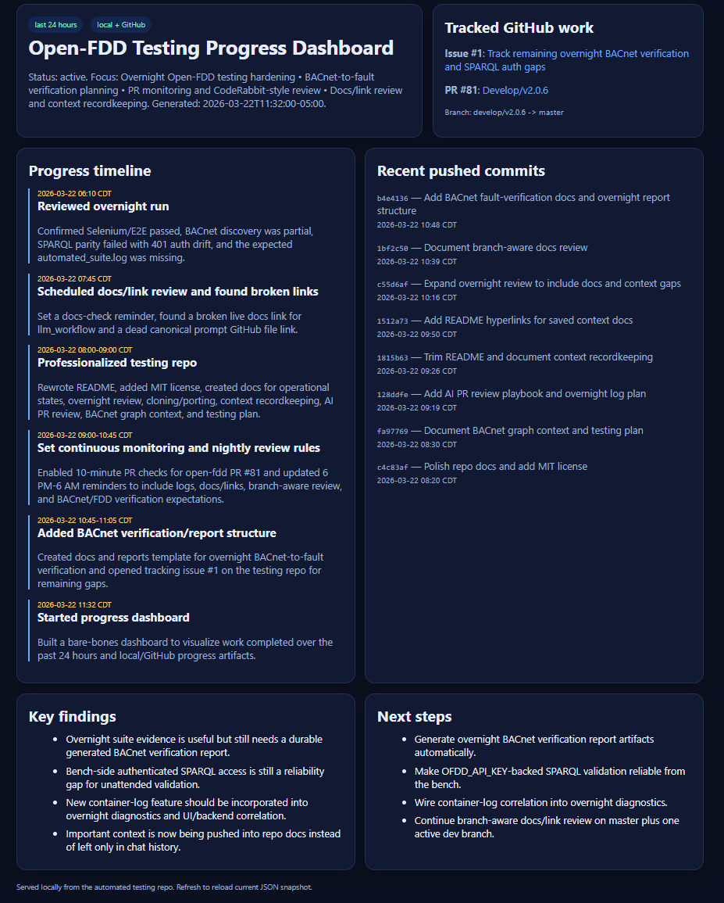

# Open-FDD Automated Testing

## Core validation layers

### 1. Frontend and API regression testing

- Selenium-based UI smoke and regression coverage
- frontend-to-API parity checks
- SPARQL CRUD and data-model validation
- verification that visible app state matches backend truth

### 2. AI-assisted data modeling verification

- export/import Open-FDD data model flows
- Brick tagging and `rule_input` mapping validation
- SPARQL checks that confirm imported data is usable by Open-FDD
- evidence that AI-assisted tagging outputs still land in the app correctly

### 3. Live BACnet and FDD verification

- fake BACnet devices with deterministic fault schedules
- BACnet scraping validation against known bad-good windows
- BACnet graph/addressing validation through SPARQL and API checks
- YAML rule hot-reload checks
- proof that faults are computed and surfaced by Open-FDD as expected
- future-facing context for optimization and supervisory logic based on equipment semantics

---

## Three operational states

This repo is organized around three real operational states that Open-FDD development and deployment move through.

### 1) Application validation state

Use this state when Open-FDD itself is the thing under test.

**Purpose**
- validate frontend behavior
- validate API behavior
- catch regressions in Selenium, SPARQL, auth, hot reload, and BACnet integration

**Primary scripts**
- `1_e2e_frontend_selenium.py`
- `2_sparql_crud_and_frontend_test.py`
- `4_hot_reload_test.py`
- `automated_suite.py`

### 2) AI-assisted data-modeling state

Use this state when a site is being modeled or remapped.

**Purpose**
- verify export/import flows
- verify Brick tagging quality
- verify `rule_input` mappings
- confirm that data modeling decisions still support FDD and UI workflows

**Primary assets**
- `sparql/`
- demo import payloads
- Open-FDD docs and model-context endpoints

### 3) Live HVAC monitoring state

Use this state when the deployment is acting like a real operations platform.

**Purpose**
- verify telemetry is being scraped
- verify rules are executing over real timeseries
- verify expected faults are visible to developers and operators
- support operator-style summaries, maintenance triage, and platform health review

**Primary assets**
- `3_long_term_bacnet_scrape_test.py`
- `fake_bacnet_devices/`
- `rules/`
- overnight automation scripts

These are not just marketing buckets. They reflect three different reasoning contexts with different evidence requirements and different failure modes.

---

## Overnight development workflow

Recommended unattended cadence:

- **Evening / overnight:** BACnet soak and fault-window validation
- **Midnight:** full regression suite
- **Morning:** human or OpenClaw review of logs, summaries, and candidate bugs

The standard morning review should answer:

- Did BACnet discovery succeed for all expected devices?
- Did scraped telemetry land for the modeled points?
- Did the expected fault windows from the fake devices show up in Open-FDD?
- Did Selenium/UI pass?
- Did SPARQL parity pass?
- Did rule hot reload still work?
- Is any failure clearly a product bug vs environment drift or auth/setup drift?

See `docs/overnight_review.md`.

---

## OpenClaw role in this repo

OpenClaw is expected to operate here as a highly capable engineering assistant that can:

- run and compare test phases
- investigate mismatches between frontend, API, BACnet, and FDD outcomes
- summarize overnight results
- verify whether a failure is likely real or merely environmental
- draft GitHub issues only when evidence is specific and reproducible

This repo is intentionally being shaped so an autonomous agent can work effectively **without turning the repository into agent-only glue code**. Human engineers should still be able to inspect the structure, understand the reasoning, and reuse the testing assets directly.

---

## Documentation and saved context

This repo documents not just test execution, but the engineering context behind the work.

Important context is saved in versioned markdown under `docs/` so humans and future agents can both inspect it.

### Where context is documented

- `docs/operational_states.md`
- `docs/overnight_review.md`
- `docs/bacnet_graph_context.md`
- `docs/ai_pr_review_playbook.md`
- `docs/testing_plan.md`
- `docs/context_and_recordkeeping.md`

### What this documentation is meant to preserve

- how the three operational states are being used
- how overnight testing is reviewed
- how BACnet graph context is interpreted
- how BACnet devices, point addressing, YAML fault rules, and rolling windows should be verified together
- how PR review and overnight log review should work
- how this experience is being recorded so future clones do not depend on tribal knowledge

For the human-facing explanation of how OpenClaw saves context in this repo, see:
- [`docs/context_and_recordkeeping.md`](docs/context_and_recordkeeping.md)

---

## License

This project is licensed under the **MIT License**. See [LICENSE](LICENSE).
so future clones do not depend on tribal knowledge

For the human-facing explanation of how OpenClaw saves context in this repo, see:
- [`docs/context_and_recordkeeping.md`](docs/context_and_recordkeeping.md)

---

## License

This project is licensed under the **MIT License**. See [LICENSE](LICENSE).
